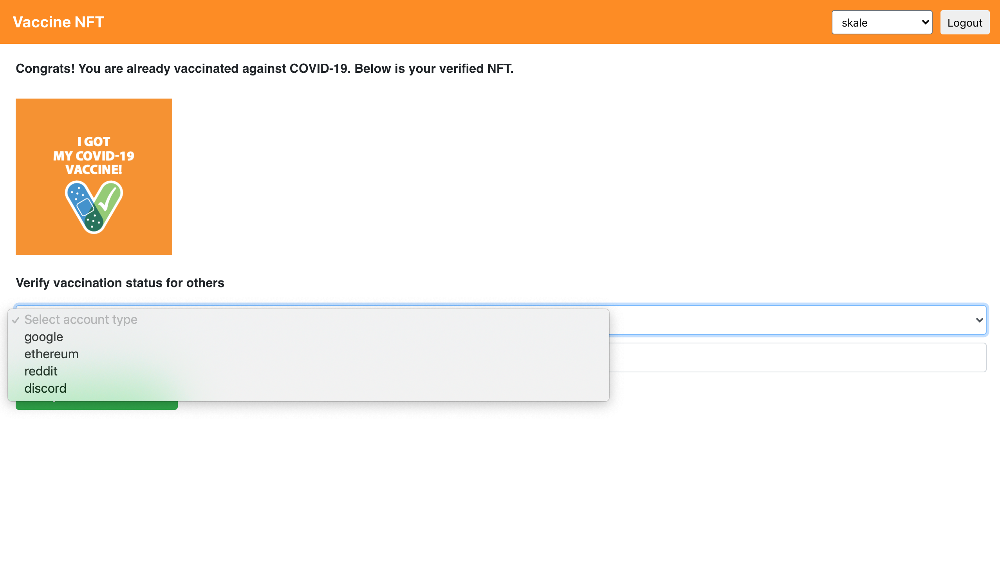

## Vaccine NFT
Growth hack to promote COVID-19 vaccination using NFTs. Get a free NFT after your COVID-19 vaccination.

### App Link
Vaccine NFT (Skale Network, Matic Mumbai Testnet, Rinkeby) - https://vaccine-nft.netlify.app/

### Screenshots





### Getting Started

1) Clone the repo

   ```
   git clone https://github.com/viraja1/vaccine_nft.git 
   ```

2) Change Directory

   ```
   cd vaccine_nft
   ```
   
3) Install packages

   ```
   npm install
   ```
   
4) Set environment variables for contract deployment for the selected network

   ```
   vi .env
   ```
   
   ```
   PRIVATE_KEY=
   SKALE_CHAIN=
   RINKEBY=
   MATIC_MUMBAI=wss://rpc-mumbai.maticvigil.com/ws
   ```
   
   Replace private key with your account private key for the contract deployment.
   
   For skale wss endpoint check the following link - https://skale.network/docs/developers/getting-started/beginner
   
   For rinkeby wss endpoint, signup for an infura account - https://infura.io/

5) Send test ETH to the account associated with the private key which will be used for the contract deployment.

    Skale faucet - https://faucet.skale.network/
    
    Matic Mumbai faucet - https://faucet.matic.network/
    
    Rinkeby faucet - https://faucet.rinkeby.io/
    
6) Deploy the contract to the selected networks using infura

   ```
   ./node_modules/.bin/truffle compile --network {network}
   ./node_modules/.bin/truffle migrate --network {network}
   ```
   
   Run the above commands separately for each network where the contract needs to be deployed by replacing {network} 
   with `skale`, `rinkeby` or `matic_mumbai`.
   
   Note down the `contract address` for `VaccineNFT` for each network where the contract was deployed.
   
7) Update the contract address for each network where the contract was deployed in src/App.js:12

   Also verify chainId and host for each network in src/App.js:12
   
8) Start the app   

   ```
   npm start 
   ```
   
9) Test the app

   http://localhost:3000/ 
   
10) Send NFT to the people who got vaccinated against COVID-19

    On the homepage, go to `Verify vaccination status for others` section. 
    Check vaccination status for their social identifier e.g. google account or ethereum address.
    
    For the social identifier, a corresponding torus ethereum wallet will be created and the ethereum address will be 
    logged in the browser developer console. Copy the ethereum address from there. 
    
    Use truffle console to send NFT to the above ethereum address.
    
    ```
    ./node_modules/.bin/truffle console --network {network}
    ```
    
    Replace {network} with `skale`, `matic_mumbai` or `rinkeby`.
    
    Use the below code in the truffle console to send NFT to a particular ethereum address. Update the value of `to`
    in the below code with an ethereum address to which the NFT needs to be sent.
    
    ```
    const to = '';
    let instance = await VaccineNFT.deployed()
    let accounts = await web3.eth.getAccounts()
    instance.safeTransferFrom(accounts[0], to, 0, 1, web3.utils.asciiToHex(''), {from: accounts[0]})
    ```
    
    Once NFT is sent, then on the homepage, go to `Verify vaccination status for others` section and check 
    if the status is updated. Similarly when the other person will login using their social identifier 
    or ethereum wallet, then they will get to know that they have received the NFT.

    
   